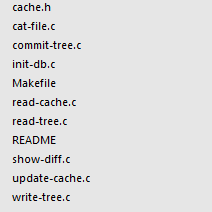
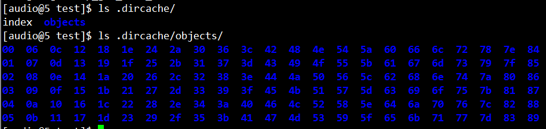

# Git Origin Source Code
This is the origin source code of git(v0.99), i'm very interested in 
the principle and workflow of it. Maybe I will take some notes here on
reading the source code. Have fun!(the origin README is [here](./linus.README))

## Source Code
linus称这是一个stupid content tracker,从其基本原理和初始代码来看，的确是这样。
SHA(Secure Hash Alogorithm)是一个很重要的概念，通过SHA值判断文件是否变化，tree和commit
也通过Object文件存储，这样每个文件，tree和commit也就通过SHA值来唯一标识。

## The Object Database(SHA1 FILE DIRECTORY)
这是一个用于存储SHI1文件的文件数据库，其实本质上只是一个文件夹，用于存放所提交的文件。文件包含Metadata信息和Blob内容，经由Zlib压缩后算出SHA1，该SHA1的前2位作为子文件夹名，后38位作为文件名。目录下图所示。

这里存放的文件包括三种：tree、blob和commit.

### blob
blob文件是指具体的文件内容，即我们所提交的文件。Blob文件会被压缩，然后计算SHA1值，所以如果文件的内容没有发生变化，那么就不会产生新的Blob文件。因为它们算出的SHA1是相同的，而SHA1值就是它们实际的存放路径。

### tree
tree文件中存放的是所提交的文件列表，每一行描述所记录的一个文件，包括：文件的权限、路径名、SHA1值。这个就能够用于保存每一次提交的具体内容，通过查询tree文件，可以知道该次提交时所含有的所有文件，然后根据每一个文件的SHA1，可以在object database中搜索出该文件。这样就达到了保存每一次提交的具体内容的目的。

### commit
commit文件是用于记录每一次提交的文件。包含的内容有：tree、parents、author、committer、changelog。其中tree是指用于保存此次提交的tree文件。Parents是指此次提交的父分支是哪些，也是对应的tree文件。Author、committer、changelog是提交的记录信息。

## 使用
1. 使用init-db初始化工作目录，类似于git init的作用。
2. 项目编写，增删改各种文件等等。
3. 使用update-cache [file-path]，保存更改至缓存中。这会生成一个index文件，改文件用于保存当前的cache。
4. 使用write-tree提交缓存中的更改。这会生成一个tree文件，当前的cache中的文件会写入到tree文件中去。命令结果会返回tree文件的sha1值。
5. 使用commit-tree <tree-sha1> [-p parent-sha1] < changelog提交这次更改。如果没有parent的信息，就会当做是第一次提交。有的话就表示改次提交是在parent基础上提交的。这里也只是一个信息的记录，其实并不会检查是否存在child-parent的关系。
6. 工具命令show-diff，用来比较当前工作目录下的文件和cache中（即index文件）记录的文件的区别。
7. 工具命令cat-file <SHA1>，查看某个sha1文件。会生成一个TEMP文件用来保存改SHA1文件中的内容。

## Summary
Now i got an overview about the principle and workflow of git, it's really simple and stupid.
And i mainly refer to this [artical](http://blog.csdn.net/gsyzhu/article/details/38065765).
